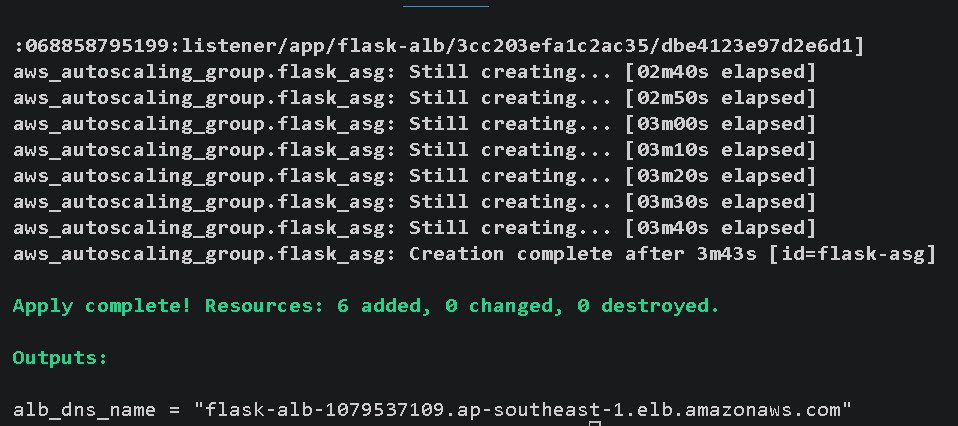
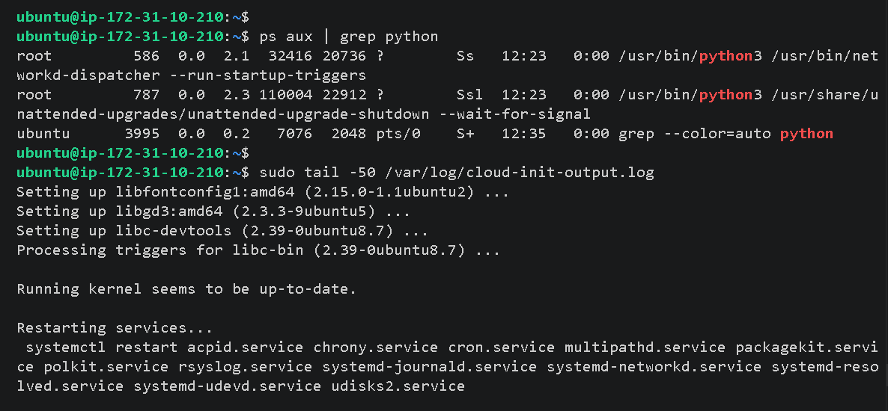
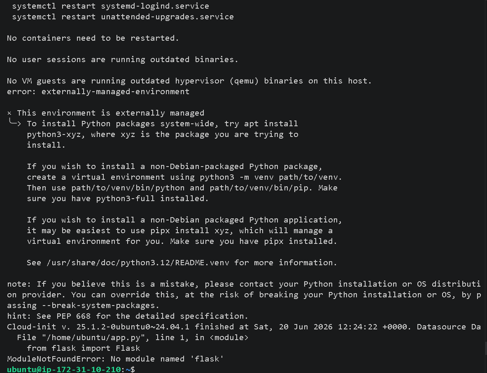
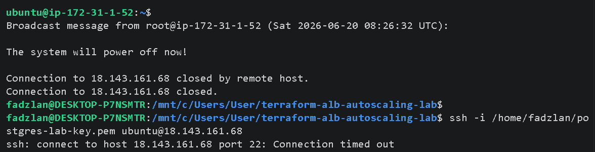
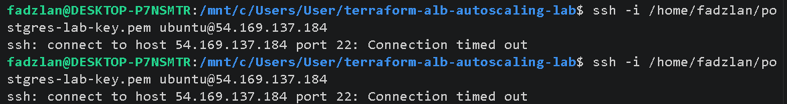
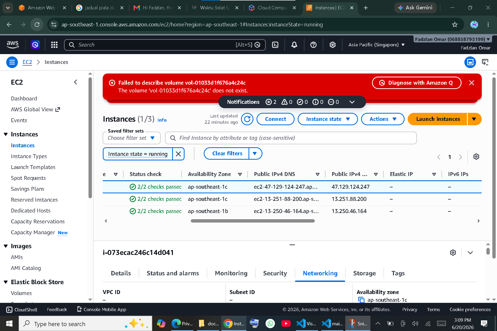

# High-Availability Automated Flask Cluster: Infrastructure-as-Code via Terraform & AWS

## Project Objective
The objective of this project is to architect, build, and deploy a secure, fault-tolerant, and dynamically scalable web application infrastructure on AWS. Utilizing an Infrastructure-as-Code (IaC) methodology via Terraform, this project replaces error-prone manual server configuration with a fully automated cloud-native ecosystem. It features an Application Load Balancer (ALB) acting as a front-end router distribution layer distributing traffic across an elastic EC2 tier governed by an Auto Scaling Group (ASG), running an automated Python/Flask web framework application.

---

## Detailed Architectural Workflow
[ Public Web Traffic: Port 80 ]
                 │
                 ▼
   ┌───────────────────────────┐
   │ Application Load Balancer │
   └─────────────┬─────────────┘
                 │ (Decides Routing / Health Checks)
     ┌───────────┴───────────┐
     ▼                       ▼
┌─────────────────┐     ┌─────────────────┐
│ EC2 Instance A  │     │ EC2 Instance B  │
│  (Port 5000)    │     │  (Port 5000)    │
└─────────────────┘     └─────────────────┘
[ Auto Scaling Tier managed dynamically via AWS ASG ]

### 1. Design
The topology relies on AWS regional core foundations. It leverages the Default VPC architecture map to automatically provision multi-Availability Zone distribution subnet arrays, ensuring that if an entire data center facility drops offline, the workload remains functional. The compute targets are decoupled from direct internet exposure using specialized Security Groups, setting the stage for strict traffic filtering.

### 2. Implement
The complete system is codified in a single unified declarative Terraform state template (`main.tf`). Using data-driven query filters, the manifest dynamically evaluates active AWS subnets and standard default network configurations. A standalone shell wrapper initialization module (`user-data.sh`) is built out natively to handle the end-to-end local software stack provisioning during initial system bootstrap sequences.

### 3. Deploy
Execution occurs entirely from a local workstation via the Terraform CLI engine. When applied, Terraform builds out the configuration in topological sequence: 
* Creating ingress/egress stateful security groupings.
* Compiling Launch Templates embedded with cryptographic Key Pair identifiers.
* Spinning up the Target Groups and Application Load Balancer logic arrays.
* Activating the core Scaling controller.

### 4. Manage
Operational tasks are delegated away from manual configuration interventions. System administrators use the integrated Launch Template settings to cleanly version operational state profiles. Compute life cycles are governed dynamically by the integrated Auto Scaling Group engine, mapping against strict elastic bounds (`Desired: 2`, `Min: 2`, `Max: 4`) while maintaining active target group tracking profiles.

### 5. Scalable
The design is built out for flexible horizontally scaled expansions. Compute scale-out rules are tied directly to an active health reporting structure (`health_check_type = "ELB"`). If tracking states breach execution rules, the system automatically registers new compute target arrays, provisions their inner OS configurations natively, and bridges them into the ALB targeting layer without human involvement.

### 6. Secure and High Available
Security policies follow the rule of least privilege. Inbound SSH configurations (Port 22) are explicitly isolated down to unique administrative workstation IP configurations, completely blocking open-world external dictionary brute-force scans. Web entry layers natively split incoming web application paths, enforcing high availability by automatically utilizing stateful target health check tracking arrays to isolate and drop failing runtime blocks instantly.

---

## Technological Tooling Matrix

| Category | Tool / Service | Purpose |
| :--- | :--- | :--- |
| **Infrastructure-as-Code** | Terraform | Complete declarative infrastructure orchestration and lifecycle state tracking. |
| **Cloud Provider** | Amazon Web Services (AWS) | Target hosting cloud environment (EC2, ASG, ALB, Launch Templates, Security Groups). |
| **Operating System** | Ubuntu Linux 24.04 LTS | The underlying secure host environment for running application nodes. |
| **Automation Scripting** | Bash Shell Scripting | Embedded user data payload script handled automatically during initial boot phases. |
| **App Framework** | Python 3 / Flask Micro-framework | Back-end service computing node rendering system properties dynamically. |
| **Local Environment** | Windows Subsystem for Linux (WSL) | Local command line engine used for SSH debugging and infrastructure control. |

---

## 📷 Project Deployment Artifacts

### 1. Stateful Infrastructure Provisioning (Terraform Deployment Execution)
*Description: Confirms the initialization and structural verification of the cloud components built completely via local terminal declarations.*


### 2. Data-user.sh script automatically installs Flask on every EC2 launched by Auto Scaling
*Description: Running these whether script is still working, completed successfully, or threw an error


### 3. This environment is externally managed to install python packages Non-Debian Packages
*Description: Using Python3 -m venv path/to/venv then use path/to/venv/bin/python


### 4. ssh: connect to host port 22: Connection timed out whether port 22 blocked
*Description: Inbound rules in Security Group whether port missing or false sources 


### 5. Security Configuration and Firewall Management
*Description: Demonstrates strict implementation of Security Group controls, showcasing Port 22 SSH restricted to administrative IP space, alongside universal Port 80/5000 web routes.*


### 6. Elastic Architecture Validation (Auto Scaling Cluster Array)
*Description: Verifies that the Auto Scaling Group has achieved the target state, running two separate EC2 compute nodes across distinct Availability Zones with proper key configurations.*


### 6. Application Verification and Load Balancing Traffic Resolution
*Description: Demonstrates the web application payload loading cleanly through the public DNS mapping of the Application Load Balancer.*


---

## Critical Commands Reference

```bash
# Initialize the local working directory and download provider plugins
terraform init

# Validate configuration syntax and preview resource addition maps
terraform plan

# Deploy infrastructure configurations live into AWS
terraform apply -auto-approve

# Force a configuration cycle by flagging the Launch Template for replacement
terraform taint aws_launch_template.flask_template

# Establish secure administrative shells into isolated Linux cloud worker nodes
ssh -i /path/to/private-key.pem ubuntu@<target-instance-public-ip>

# Stream live bootstrapping execution history logs for real-time node debugging
sudo tail -f /var/log/cloud-init-output.log

# Evaluate running execution instances filtered down to specific runtimes
ps aux | grep python

## Demonstrated Core Engineering Skills

Declarative Infrastructure Management: Hands-on mastery of IaC deployments via Terraform, state file synchronization, and resource lifecycle controls.

Network Infrastructure & Perimeter Defense: Crafting stateful VPC security groups, implementing the rule of least privilege for network ingress, and configuring elastic route targets.

Automated Host Bootstrapping: Advanced knowledge of Cloud-Init automation design via user-data.sh wrappers to handle setup sequences seamlessly on raw operating system nodes.

High-Availability System Design: Implementation of decoupled Application Load Balancer routing logic and Auto Scaling elasticity to insulate systems against hardware failure.

Linux Systems Administration: Competence with WSL execution, SSH-key validation mechanisms, process management via standard utilities, and core log diagnostics parsing.

## Key Insights Learned
Understanding System Launch Lifecycle Sequences: Learned that updating Launch Templates inside an Auto Scaling architecture does not alter existing runtime compute assets until active lifecycle recycling patterns or instance teardowns are initiated.

Handling Modern Linux Environment Constraints (PEP 668): Experienced how newer OS variations (Ubuntu 24.04) enforce system-level package integrity checks by blocking global pip downloads, requiring localized virtual environment paths (python3 -m venv) or override criteria (--break-system-packages) for deployment scripts.

Log-Driven Diagnostic Engineering: Discovered that checking /var/log/cloud-init-output.log is vital for diagnosing background infrastructure configuration issues when troubleshooting systems without active terminal outputs.

The Importance of Dynamic Automation: Learned that setting up automated bootstrapping scripts saves significant time and effort, making it easy to configure scaling clusters without needing manual human adjustments.
